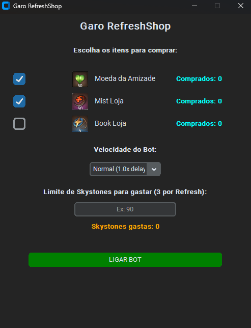

# ⚔️ Garo RefreshShop - Epic Seven Bot

<p align="center">
  
</p>

IMPORTANTE: Execute a IDE como administrador e Abra a loja antes de ligar o bot.

O **Garo RefreshShop** é uma aplicação desktop desenvolvida em Python para automatizar a renovação de estoque (refresh) da loja da taverna no jogo *Epic Seven*. 

O bot monitora a tela em tempo real, identifica a presença de itens de interesse (Bookmark de Alcoviteiro, Medalhas de Covenante, etc.), realiza as compras e contabiliza o consumo de Skystones e recursos em uma interface moderna e responsiva.

---

## 🛠️ Tecnologias Utilizadas

* **Python 3.12**
* **CustomTkinter**: Interface gráfica moderna e customizável.
* **PyAutoGUI / PyDirectInput**: Automação de cliques e movimentação do ponteiro do mouse.
* **OpenCV (`opencv-python`) / Pillow**: Reconhecimento de imagem e localização dos itens na tela.
* **Keyboard**: Monitoramento global da tecla de atalho de interrupção (`ESC`).

---

## 📂 Estrutura do Projeto

```
GaroRefreshShop/
├── moedas_img/            # Diretório de imagens base para reconhecimento na tela
├── .gitignore             # Filtro de arquivos para versionamento Git
├── Interface_B.py         # Thread principal da interface gráfica (CustomTkinter)
├── bot_taverna.py         # Thread de automação e lógica de leitura de tela
├── instalar.bat           # Script de automação de instalação de dependências
├── requirements.txt       # Módulos e bibliotecas requeridos pelo projeto
└── README.md              # Documentação do projeto
```

## - Instalação das dependências

1. Criar e ativar o ambiente virtual

```
python -m venv .venv
.\.venv\Scripts\activate
```

2. Instalar as dependências

```
pip install -r requirements.txt
```

3. Executar o aplicativo
```
python Interface_B.py
```

## 📖 Documentação das Funções e Módulos
### 🛑 1. Módulo da Interface (Interface_B.py)

Gerencia a janela principal, opções de configuração do usuário, logs em tempo real e ponte de comunicação thread-safe com o bot.

-- __init__(): Inicializa a janela CTk, define a geometria da tela, temas visuais, carregamento de componentes de UI (checkboxes, campos numéricos e botões) e estados iniciais da aplicação.

-- coletar_e_iniciar(): Coleta os parâmetros definidos pelo usuário (quais itens comprar, velocidade do bot, limite de Skystones), instancia o motor do bot em uma Thread separada (threading.Thread) e inicia o monitoramento assíncrono do teclado.

-- verificar_tecla_esc(): Executa uma checagem periódica não-bloqueante via self.after(100, ...) na thread principal do Tkinter para identificar se a tecla ESC foi pressionada, acionando o encerramento seguro.

-- alternar_estado_bot(): Funciona como uma chave (toggle) para o botão principal da interface. Se o bot estiver desligado, chama coletar_e_iniciar(); se estiver rodando, aciona o parar_bot().

-- parar_bot(mensagem): Sinaliza a interrupção da execução para a thread do bot, restaura a cor, o estado de clique e o texto do botão para "LIGAR BOT".

-- atualizar_sky_interface(gastos): Atualiza o contador visual de Skystones gastas no painel da interface.

-- atualizar_contador_interface(nome_foto): Identifica qual item foi comprado e incrementa seu respectivo contador na tela.

### 🤖 2. Módulo de Automação (bot_taverna.py)
 Lida com a varredura da tela do jogo, manipulação do mouse e lógica de verificação da loja.

-- __init__(itens_escolha, velocidade, interface_app, limite_sky): Configura as imagens que devem ser procuradas, os tempos de espera baseados na velocidade selecionada, o ponteiro de comunicação da interface e o conjunto de deduplicação (comprados_na_rodada).

-- iniciar(): Ponto de entrada do loop principal da automação. Chama sequencialmente a varredura de itens e o refresh da loja até que a flag de execução seja alterada ou o limite de Skystones seja atingido.

-- abrir_loja() / verificar_loja(): Captura as coordenadas da tela e busca padrões de imagem equivalentes aos itens configurados utilizando correspondência visual.

-- comprar_item(posicao, nome_foto): Executa a sequência física de movimentos e cliques no botão de compra e na tela de confirmação do jogo. Possui uma trava interna baseada em set() para evitar contagem duplicada na interface em cliques de confirmação lentos.

-- resetar_loja(): Clica nos botões de atualização da loja (Refresh), incrementa o contador global de Skystones gastas (+3) e limpa a memória temporária de itens comprados na rodada.
